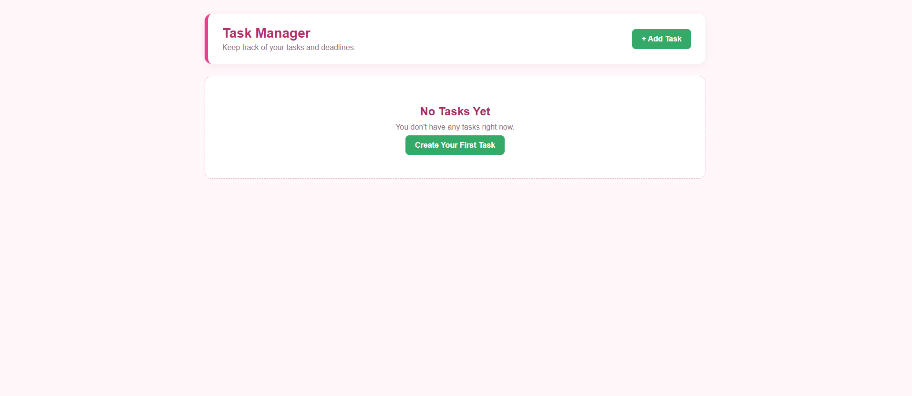
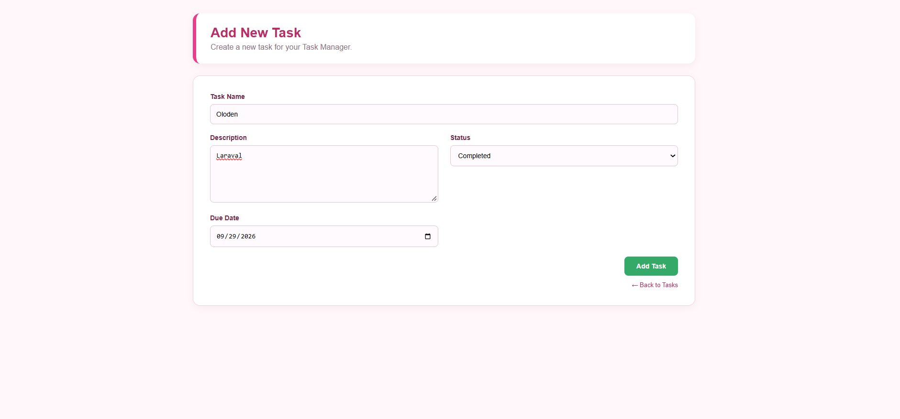
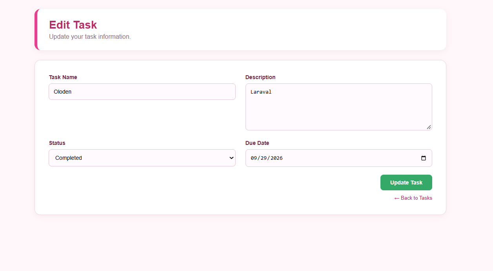
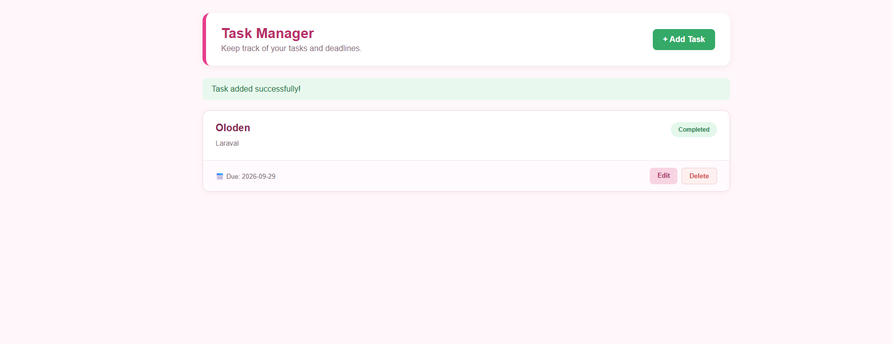

# Personal Task Manager

Project Code: WST21-PM-2026-SF
Student Name: Dianne Oloden
Course & Year: BSIT - 2nd Year

Database Used: MySQL


# Submitted by:
- Dianne O. Oloden
- WST21-PM-2026-SF
- BSIT-2 SEC 7

## Features

- Add new tasks
- View all tasks
- Edit existing tasks
- Update task information
- Delete tasks
- Task status: Pending or Completed
- Due dates
- Confirmation before deleting a task
- Simple and responsive user interface

## Screenshots

### Dashboard


### Add Task


### Edit Task


### Final Result


## Technologies Used

- Laravel
- PHP
- MySQL
- HTML
- CSS
- Blade Templates
- Git and GitHub

## Requirements

Before running the project, install:

- PHP
- Composer
- MySQL
- Git
- Visual Studio Code

## Installation

### 1. Clone the repository

```bash
git clone https://github.com/obliandaolodendianne-gif/task-manager.git
